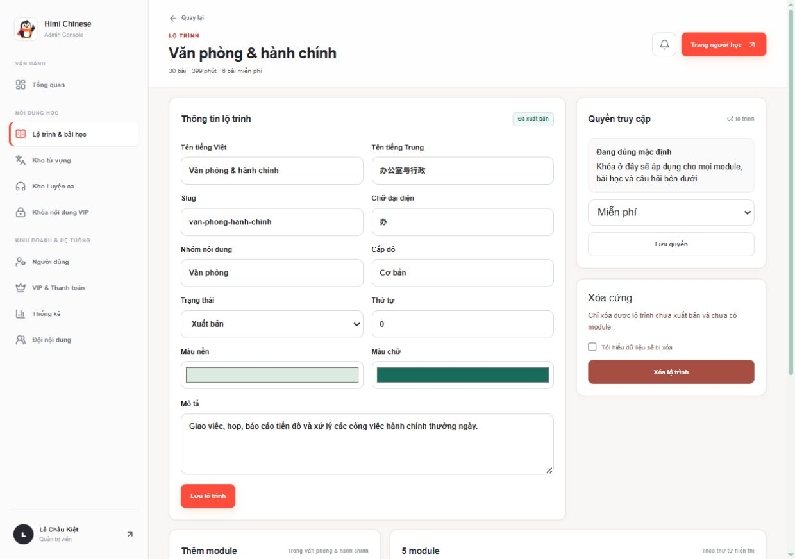
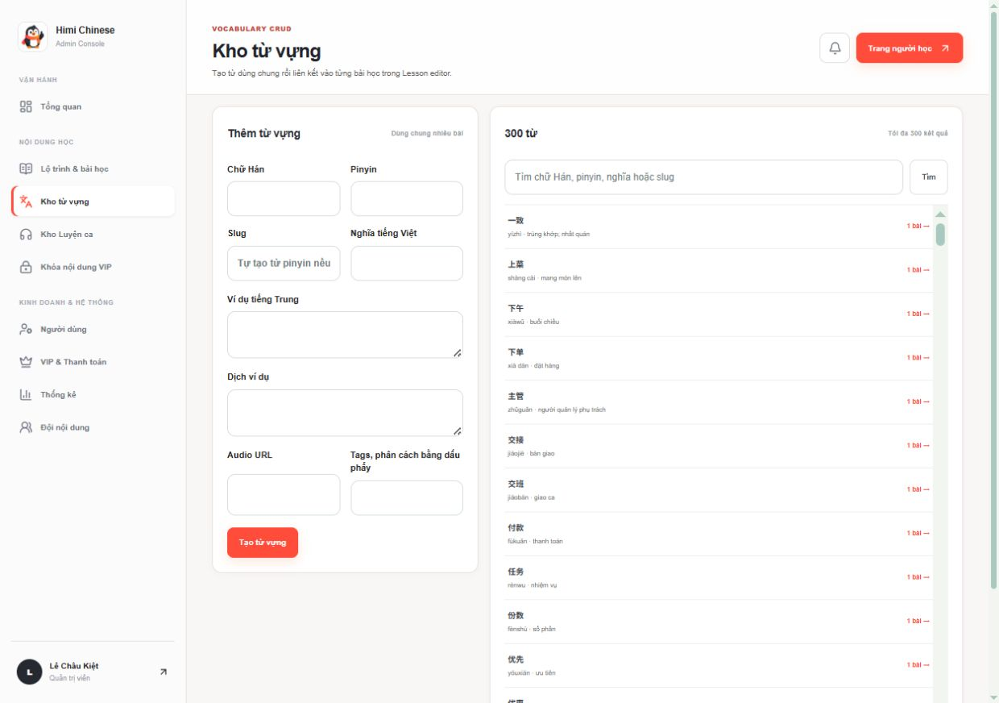
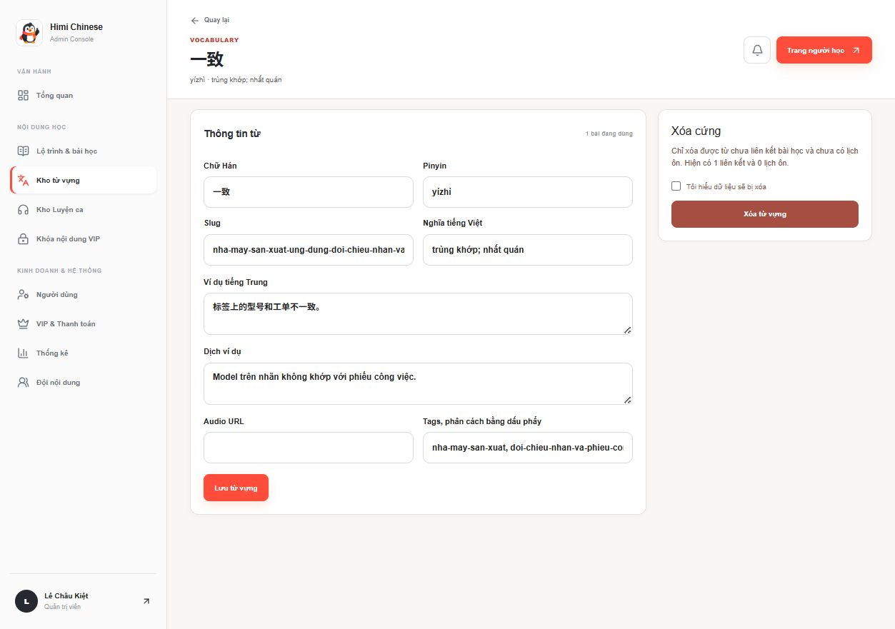
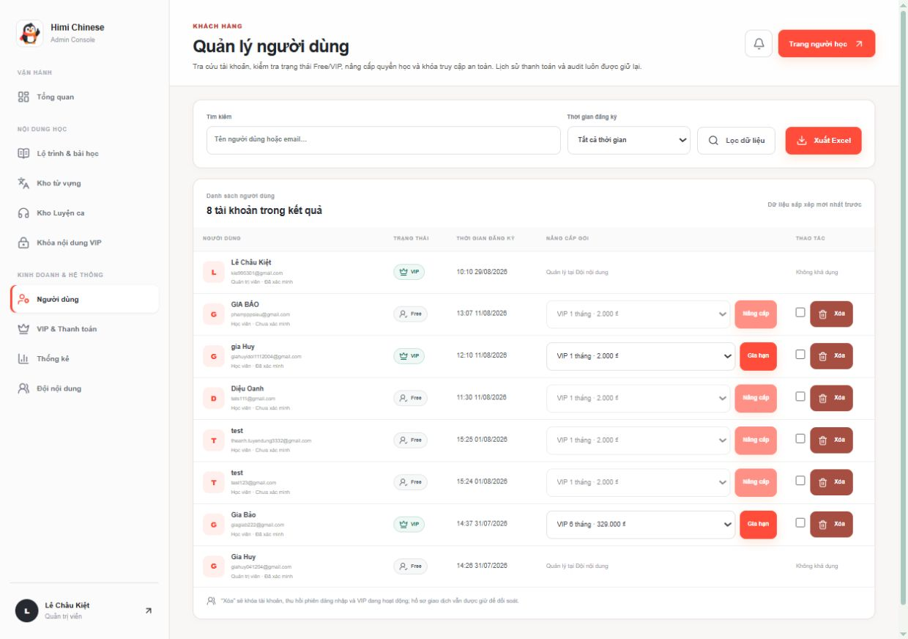
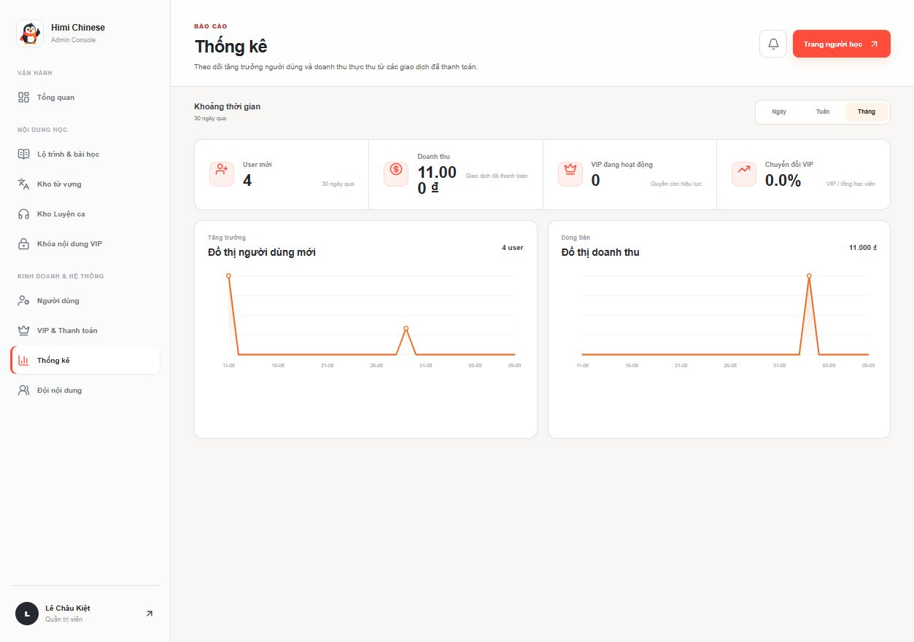
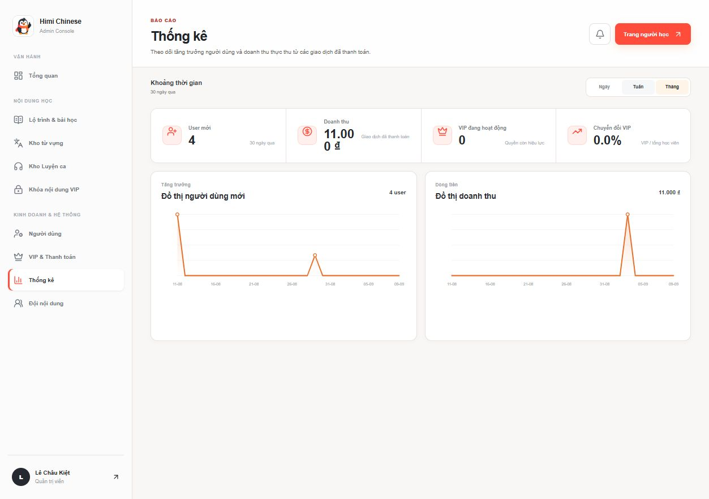
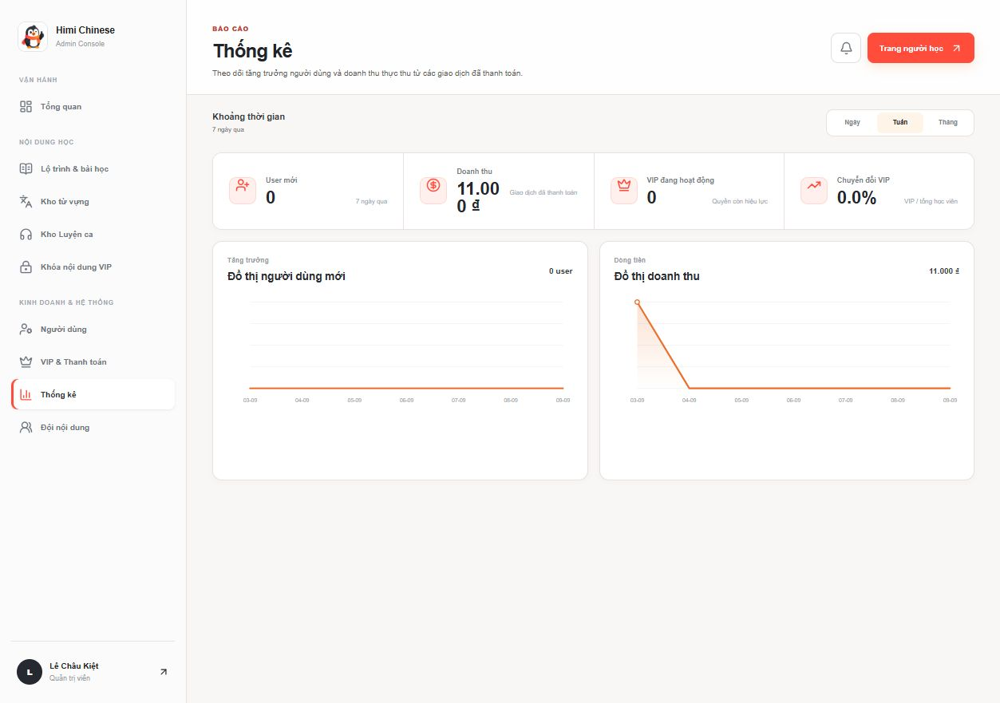

# Audit UX điều hướng Admin theo mô hình SPA

## Phạm vi audit

- Surface: Admin Console tại `http://localhost:3001/admin`.
- Luồng: chi tiết lộ trình → Kho từ vựng → chi tiết từ → quay lại → Người dùng → Thống kê → đổi khoảng thời gian.
- Viewport: 1253 × 882 CSS px, DPR 1, desktop.
- Mục tiêu người dùng: click vào chức năng phải có phản hồi ngay, giữ được ngữ cảnh, không tạo cảm giác tải lại cả trang.
- Kết quả tổng quát: giao diện đã dùng client-side navigation và có phản hồi tốt ở sidebar, nhưng thời gian chờ 3–5 giây cùng phản hồi không đồng đều khiến trải nghiệm vẫn giống website nhiều trang hơn là SPA.

## Các bước đã kiểm tra

### 1. Chi tiết lộ trình — Tốt

- Bố cục rõ, sidebar giữ vị trí và mục đang chọn dễ nhận biết.
- Form dài nhưng CTA và nhóm nguy hiểm được tách riêng hợp lý.

### 2. Sidebar → Kho từ vựng — Cần cải thiện

- Thời gian điều hướng đo được: khoảng **4,8 giây**.
- Sidebar có spinner và thanh tiến trình, nhưng nội dung cũ vẫn nằm trên màn hình trong thời gian chờ.
- Danh sách tải tối đa 300 bản ghi cùng lúc; tải đầu vào và DOM đều nặng.

### 3. Danh sách → chi tiết từ — Cần cải thiện

- Link chi tiết không có trạng thái pending riêng nên click có thể trông như chưa nhận thao tác.
- Trang chi tiết có phân cấp tốt, nhưng nút quay lại không giữ query, trang và vị trí cuộn của danh sách.

### 4. Chi tiết → quay lại danh sách — Cần cải thiện

- Thời gian quay lại đo được: khoảng **3,4 giây**.
- Danh sách được tải lại từ đầu. Với người dùng đang tìm/duyệt sâu, việc mất bộ lọc hoặc vị trí cuộn làm tăng thao tác lặp.

### 5. Sidebar → Người dùng — Cần cải thiện

- Thời gian điều hướng đo được: khoảng **3,4 giây**.
- Mật độ bảng tốt cho nghiệp vụ, nhưng chữ phụ rất nhỏ và thao tác nguy hiểm nằm sát thao tác nâng cấp.
- Trạng thái chờ hiện chỉ rõ trên sidebar, chưa gắn với vùng nội dung đang thay đổi.

### 6. Trạng thái chờ khi mở Thống kê — Khá

- Điểm tốt: mục “Thống kê” chuyển sang trạng thái pending, có spinner và thanh tiến trình phía trên.
- Điểm yếu: bảng Người dùng cũ vẫn tương tác được trong gần 3 giây; người dùng có thể click tiếp hoặc thao tác nhầm trên nội dung sắp bị thay thế.

### 7. Trang Thống kê đã tải — Tốt

- Điều hướng hoàn tất sau khoảng **3,1 giây**.
- Phân cấp thông tin và trạng thái active của sidebar rõ ràng.
- Biểu đồ có tên truy cập và dữ liệu thay thế cho trình đọc màn hình.

### 8. Đổi bộ lọc Tháng → Tuần — Yếu

- Thời gian phản hồi: khoảng **3,1 giây**.
- Không có spinner, `aria-busy`, skeleton hay thông báo đang cập nhật; chỉ có trạng thái nhấn rất ngắn.
- Trong lúc chờ, tab cũ vẫn trông như đang được chọn và số liệu cũ vẫn hiển thị.

### 9. Bộ lọc Tuần hoàn tất — Tốt

- Dữ liệu và tab active cập nhật đúng.
- Trạng thái kết quả rõ, nhưng phản hồi chỉ xuất hiện sau khi toàn bộ dữ liệu đã về.

## Điểm mạnh đã xác nhận

- Điều hướng chính dùng `Link`, `useRouter` và prefetch thủ công; không phải hard reload truyền thống.
- Sidebar có trạng thái active, pending, spinner, thanh tiến trình và vùng `aria-live` báo “Đang tải trang quản trị…”.
- Có `loading.tsx`, focus ring toàn cục, heading phân cấp, nhãn form và `aria-current` tương đối tốt.
- Không ghi nhận warning/error trong console ở các bước audit.

## Rủi ro UX chính

### P1 — Độ trễ 3–5 giây là nguyên nhân lớn nhất làm mất cảm giác SPA

- 4,8 giây khi mở Kho từ vựng; 3,4 giây khi quay lại; 3,4 giây khi mở Người dùng; 3,1 giây khi mở/đổi bộ lọc Thống kê.
- `prefetch={false}` xuất hiện trên nhiều link nội bộ, đặc biệt link danh sách → chi tiết và nút quay lại.
- Kho từ vựng tải 300 bản ghi và chạy `lessonCount` dạng subquery cho từng hàng.

### P1 — Phản hồi pending không đồng đều

- Sidebar có feedback tốt, nhưng link trong bảng, link quay lại và tab lọc thời gian không có cùng cơ chế.
- Nội dung cũ vẫn tương tác được trong khi route mới đang tải.

### P1 — Admin shell chưa nằm trong layout dùng chung

- `app/admin/layout.tsx` chỉ trả về `children`.
- Mỗi page tự render lại `main`, `section-shell` và `AdminConsoleHeader`, khiến việc giữ sidebar/header, trạng thái pending, focus và cache UI khó nhất quán.

### P2 — Danh sách không giữ ngữ cảnh

- Link “Quay lại” là URL cố định, không bảo toàn `q`, `page`, sort hoặc vị trí cuộn.
- Danh sách 300 từ nằm trong vùng scroll riêng nhưng không có phân trang/virtualization.

### P2 — Server action thiếu trạng thái tại chỗ

- Form submit trực tiếp tới server action và redirect bằng query `?success=`.
- Không thấy `useFormStatus`, `useOptimistic`, dirty-state guard hoặc chống click lặp cho các form admin.
- `resultRedirect` revalidate nhiều trang không liên quan trên hầu hết mutation, có thể làm cache nóng bị vô hiệu hóa quá rộng.

### P2 — Mật độ chữ thấp gây khó đọc

- Nhiều nhãn phụ ở mức 8–10px. Điều này đặc biệt khó với bảng dày và màn hình có scaling.
- Focus ring toàn cục là điểm tốt; kích thước target sidebar 38px vẫn dùng được nhưng nên nâng lên 42–44px.

## Rủi ro accessibility

- Tốt: nav có tên, active dùng `aria-current`, pending sidebar có `aria-live`, form có label, biểu đồ có dữ liệu thay thế.
- Cần sửa: filter Thống kê không thông báo trạng thái loading; vùng nội dung cũ không có `aria-busy` khi đang chuyển route.
- Sau điều hướng, focus trở về document thay vì heading mới; người dùng bàn phím/trình đọc màn hình không được đưa ngay tới nội dung mới.
- Font 8–10px tạo rủi ro đọc hiểu dù độ tương phản nhìn chung ổn.
- Audit bằng desktop/browser không đủ để khẳng định WCAG đầy đủ; chưa kiểm tra screen reader thật, zoom 200%, mobile và hành vi khi mạng lỗi.

## Giải pháp đề xuất

| Ưu tiên | Giải pháp | Tác động |
|---|---|---|
| 1 | Đưa sidebar + route progress vào `app/admin/layout.tsx`; page chỉ render header/content riêng | Shell luôn tồn tại, giảm nhấp nháy, quản lý pending và focus thống nhất |
| 2 | Tạo `AdminLink` dùng `useLinkStatus()` cho sidebar, row link, quay lại và filter | Mọi click có spinner/disabled/`aria-live` ngay lập tức |
| 3 | Bỏ `prefetch={false}` với top-level và các link quan trọng; dynamic row chỉ prefetch khi hover/focus hoặc khi sắp vào viewport | Giảm chờ mà không prefetch cả 300 trang chi tiết |
| 4 | Thêm skeleton theo vùng nội dung sau 150–200ms; làm mờ/khóa click vùng dữ liệu cũ khi pending | Không còn cảm giác “click không ăn” và tránh thao tác nhầm |
| 5 | Phân trang server 30–50 từ/trang, giữ `q/page/sort` trong URL; tối ưu `lessonCount` bằng join/group và index tìm kiếm | Giảm đáng kể payload, query và DOM |
| 6 | Giữ ngữ cảnh list/detail bằng `returnTo` hoặc browser history state; khôi phục scroll | Quay lại đúng nơi người dùng đang làm việc |
| 7 | Dùng `useFormStatus` cho mọi nút lưu/xóa/nâng cấp; disabled + “Đang lưu…” + toast; thêm dirty-form guard | Chống click lặp, tránh mất dữ liệu và tăng độ tin cậy |
| 8 | Thu hẹp `revalidatePath`/tag theo entity vừa thay đổi | Giữ cache các khu vực không liên quan và giảm tải sau mutation |
| 9 | Với filter dashboard, optimistic active tab và giữ chart cũ với lớp loading mờ | Cảm giác tức thời dù server vẫn mất thời gian |
| 10 | Nâng body text phụ lên tối thiểu 11–12px, control lên 42–44px; focus heading sau route change | Dễ đọc và dễ thao tác hơn |

## Kiến trúc triển khai khuyến nghị

Không cần chuyển toàn bộ admin thành client-only SPA. Next App Router hiện tại đã hỗ trợ SPA navigation; nên giữ Server Components cho dữ liệu và cải thiện theo mô hình:

1. Persistent `AdminShell` trong layout.
2. Route/segment loading ở vùng `<main>`.
3. `AdminLink` + `useLinkStatus()` cho feedback thống nhất.
4. Server pagination và cache/revalidation hẹp.
5. `useFormStatus`/optimistic UI cho mutation.

## Thứ tự triển khai thực tế

- Sprint nhanh: persistent shell, `AdminLink`, pending overlay, submit pending state.
- Sprint hiệu năng: pagination từ vựng/người dùng, query/index, cache và revalidation.
- Sprint polish: giữ scroll/filter, dirty-state guard, focus management, tăng cỡ chữ.

## Giới hạn bằng chứng

- Chỉ audit viewport desktop 1253 × 882.
- Không gửi form hoặc thực hiện hành động thay đổi dữ liệu.
- Không kiểm tra mạng lỗi/offline, mobile, zoom 200% hoặc screen reader thật.
- Timing là thời gian tương tác end-to-end trên môi trường dev local, không phải benchmark production.
